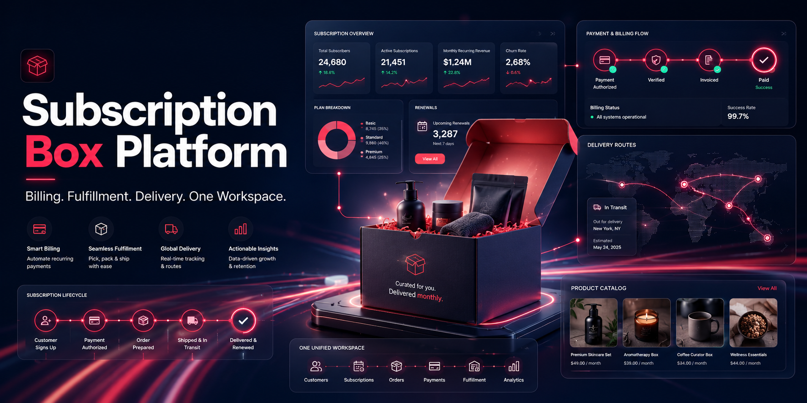
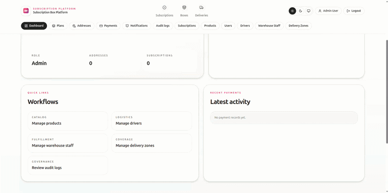

# Subscription Box Platform

Enterprise-grade subscription commerce platform built with Laravel.


<!-- REPLACE: docs/readme-media/cover-dashboard-light.png -->

## Overview

Subscription Box Platform unifies customer subscriptions, billing records, monthly box operations, delivery workflows, and admin operations into one system.

Core capabilities:
- Account registration and role-based access (subscriber, admin, driver, warehouse staff)
- Subscription lifecycle with payment simulation and transaction records
- Box generation and customization workflows
- Delivery tracking, claims handling, and operations visibility
- Admin control panels for products, drivers, warehouse staff, and delivery zones
- Growth modules: referrals, rewards, promo codes, gift subscriptions, flash sales, social posts

## Product Demo

### Full Product Walkthrough

<!-- REPLACE: docs/readme-media/demo-full-flow.gif -->

## Screenshots

### Public Experience

<!-- REPLACE: docs/readme-media/screenshot-home.png -->


<!-- REPLACE: docs/readme-media/screenshot-plans.png -->

### Authenticated Dashboard

<!-- REPLACE: docs/readme-media/screenshot-dashboard.png -->

### Admin Panels

<!-- REPLACE: docs/readme-media/screenshot-ops-products.png -->


<!-- REPLACE: docs/readme-media/screenshot-ops-drivers.png -->


<!-- REPLACE: docs/readme-media/screenshot-ops-warehouse.png -->

## Tech Stack

- PHP 8.4
- Laravel 13
- Tailwind CSS v4 + Vite
- PostgreSQL
- PHPUnit 12
- Lucide Icons
- Leaflet/OpenStreetMap (mapping-related modules)

## Architecture Snapshot

- `app/Http/Controllers` — application and operations controllers
- `app/Services` — core domain operations and business logic
- `app/Http/Requests` — validation layer
- `resources/views` — Blade UI layer
- `routes/web.php` — route definitions and middleware grouping
- `tests/Feature` — feature-level behavior verification

## Getting Started

### 1) Requirements

- PHP 8.4+
- Composer 2+
- Node.js 20+
- npm
- PostgreSQL 16+
- Git

Optional:
- Docker + Docker Compose

### 2) Clone

```bash
git clone https://github.com/MoaazHF/Subscription-Box.git
cd Subscription-Box
```

### 3) Install Dependencies

```bash
composer install
npm install
```

### 4) Configure Environment

Create `.env` in project root.

```env
APP_NAME=Laravel
APP_ENV=local
APP_KEY=
APP_DEBUG=true
APP_URL=http://localhost:8005

DB_CONNECTION=pgsql
DB_HOST=127.0.0.1
DB_PORT=5435
DB_DATABASE=subscription_box
DB_USERNAME=subscription_box
DB_PASSWORD=secret

DB_TEST_DATABASE=subscription_box_test
FORWARD_DB_PORT=5435
FORWARD_PGADMIN_PORT=5050
PGADMIN_DEFAULT_EMAIL=admin@subscription-box.project
PGADMIN_DEFAULT_PASSWORD=secret

SESSION_DRIVER=database
CACHE_STORE=database
QUEUE_CONNECTION=database
FILESYSTEM_DISK=local

VITE_APP_NAME="${APP_NAME}"
```

Generate app key:

```bash
php artisan key:generate
```

### 5) Start Database

Docker:

```bash
docker compose up -d
```

Services:
- PostgreSQL: `127.0.0.1:5435`
- pgAdmin: `http://127.0.0.1:5050`

### 6) Migrate + Seed

```bash
php artisan migrate --seed
php artisan storage:link
```

### 7) Run App

Recommended:

```bash
composer run dev
```

## Default Seeded Accounts

- Subscriber: `test@example.com` / `password`
- Admin: `admin@example.com` / `password`
- Driver: `driver@example.com` / `password`
- Warehouse staff: `warehouse@example.com` / `password`

## Key URLs

- Home: `http://127.0.0.1:8005/`
- Login: `http://127.0.0.1:8005/login`
- Register: `http://127.0.0.1:8005/register`
- Plans: `http://127.0.0.1:8005/plans`
- Docs: `http://127.0.0.1:8005/docs`

Admin operation boards:
- Products: `http://127.0.0.1:8005/ops/products`
- Drivers: `http://127.0.0.1:8005/ops/drivers`
- Warehouse staff: `http://127.0.0.1:8005/ops/warehouse-staff`
- Delivery zones: `http://127.0.0.1:8005/ops/delivery-zones`

## Testing

Run all tests:

```bash
php artisan test --compact
```

Run specific test:

```bash
php artisan test --compact tests/Feature/AdminOperationsFlowTest.php
```

## Build

```bash
npm run build
```

## Media Asset Naming Convention

Use this folder:
- `docs/readme-media/`

Suggested asset names:
- `cover-dashboard-light.png`
- `demo-full-flow.gif`
- `demo-subscription-payment.gif`
- `demo-admin-ops.gif`
- `demo-product-image-update.gif`
- `screenshot-home.png`
- `screenshot-plans.png`
- `screenshot-dashboard.png`
- `screenshot-ops-products.png`
- `screenshot-ops-drivers.png`
- `screenshot-ops-warehouse.png`

## Troubleshooting

### Vite manifest error

```bash
npm run build
```

or keep dev server running:

```bash
npm run dev
```

### DB connection refused

- verify PostgreSQL is running
- verify `.env` DB host/port/user/password
- if using Docker:

```bash
docker compose ps
```

### Product images not visible

```bash
php artisan storage:link
```

### SQLite driver error in tests

Install PDO SQLite extension or use PostgreSQL test DB configuration.
